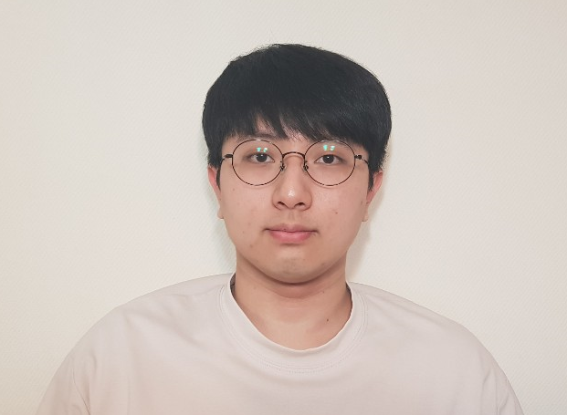
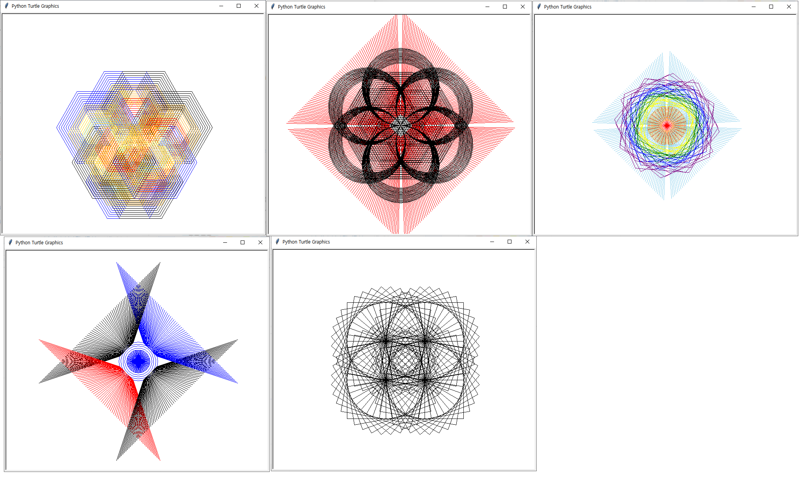
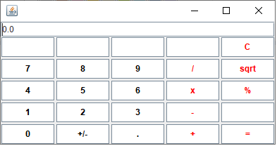

# 이력서



한림대학교 빅데이터전공 이재성
> - __E-mail__
>> isl1@naver.com / isl121314@gmail.com
> - __전화번호__
>> __010-4785-3727__
> 
> - __학력__
>> __강원고등학교 졸업__
>>
>> __한림대학교 재학__ (2022년 졸업 예정)
> - github 주소
>> https://github.com/jaeseonglee
>
---
### 간단한 자기소개
저는 한림대학교에 재학중인 이재성입니다.

|자기|소개|
|-----|-----|
|나이| 24살|
|취미| 음악감상|
|병역| 육군 병장 만기 전역|
|종교| 무교|
|면허|1종 보통 면허|

지금까지 사용해본 프로그래밍 언어로는
- java
- C (가장 선호하는 프로그래밍 언어)
- C++
- C#
- python
- R

등이 있습니다.

최근에는 linux 운영체제에서 C언어를 프로그래밍을 공부중이고, linux 환경에서 프로그래밍을 하는 다른 사람들에게 알려 줄 수 있는 수준으로 끌어 올리는 것이 이상적인 목표입니다.

 목표에 가까운 수준의 프로그래밍을 할 수 있다면 숫자야구나 스도쿠같은 게임 구현이나 통신에 활용될 수 있는 프로그램을 만들고 싶습니다.

---
## 프로젝트 경험
이렇다 할 수상 경력이 없어서 지금까지 컴퓨터공학에 대해 공부하면서 진행했던 프로젝트에 대한 리뷰입니다.

### 1_1 python turtle image
---


- [1_1_python](https://github.com/jaeseonglee/1_1_python)

2016년 1학년, python을 배우며 turtle 모듈을 통해 여러 그림을 그렸던 프로젝트입니다.

링크를 통해 코드를 보면 1학년때라 그런지 주석도 없고 수정 사항이 몇몇 보이긴 하지만 당시엔 코드를 통해 무언가 결과를 도출해내는 성취감에 만족하면서 진행했었습니다.

실제로 사용한 함수는 적은 편이고 코드도 짧은 편이라고 생각합니다.

아래는 당시 사용했던 코드를 일부 정리했습니다.
```python
import turtle           # turtle 모듈
tur = turtle.Turtle()   # 변수에 turtle 객체 저장

tur.shape('turtle')     # 거북이 모양 뿐만 아니라 
                        # 'classic' : 화살표, 'triangle' : 삼각형 등이 있습니다.

tur.color('blue')       # 색깔 변경 

tur.penup()             # penup 하면 그리지 않는 형태
tur.pendown()           # pendown 하면 그리는 형태

tur.forward(100)        # 현재 방향대로 100 만큼 전진

tur.right(180)          # 오른쪽으로 180도 회전
tur.hideturtle()        # 그리기 포인터 숨기기
```


---
### 1_2 java calculator
---

- [calculator](https://github.com/jaeseonglee/1-1-Eclipse-File/blob/master/H.U.S/Calculator.java)

1학년 때는 동아리 활동을 통해서 선배들, 동기들과 함께 프로그래밍을 공부했었습니다.

java를 배우던 교재와 오픈소스를 활용해 프로그래밍을 하고, 동아리에서 질문과 수정을 통해 완성한 프로그램이라 기억에 많이 남습니다.

링크를 확인하면 역시나 이 때도 주석을 쓰는 습관이 부족한 것을 확인 할 수 있습니다.
```java
private void calculate (double n) {
		if(operator.equals("+"))
			result += n; // 덧셈   
		else if (operator.equals("-"))
			result -= n; // 뺄셈
		else if (operator.equals("x"))
			result *=n;  // 곱셈
		else if (operator.equals("/"))
			result /= n;  // 나눗셈
		else if (operator.equals("="))
			result = n;  // 결과
		else if (operator.equals("%"))
			result %= n;  // x를 y로 나눈 나머지
		else if (operator.equals("sqrt")) 
			result = Math.sqrt(n);
		else if (operator.equals("+/-")) {
			result =  (double) n * -1.0;
		}
		display.setText(" " + result);
	}
```

### 2_1 image processing(+opencv)
---
군대 전역 후, 과거 코드들을 보면서 스스로의 단점을 보완하고자 마음먹었던 2학년입니다. 하지만 마음먹은 대로 일이 이뤄지지 않는 법이죠  :laughing:

### 3_1 윈프
---


### 3_2 system programming, 그리고 현재.
---
d

### 
---
